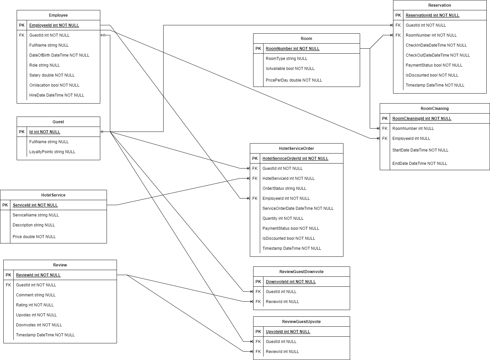
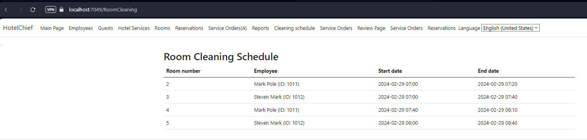
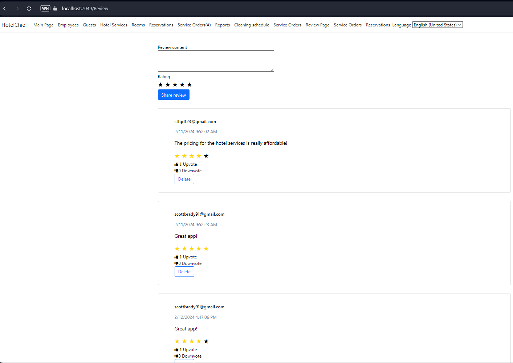
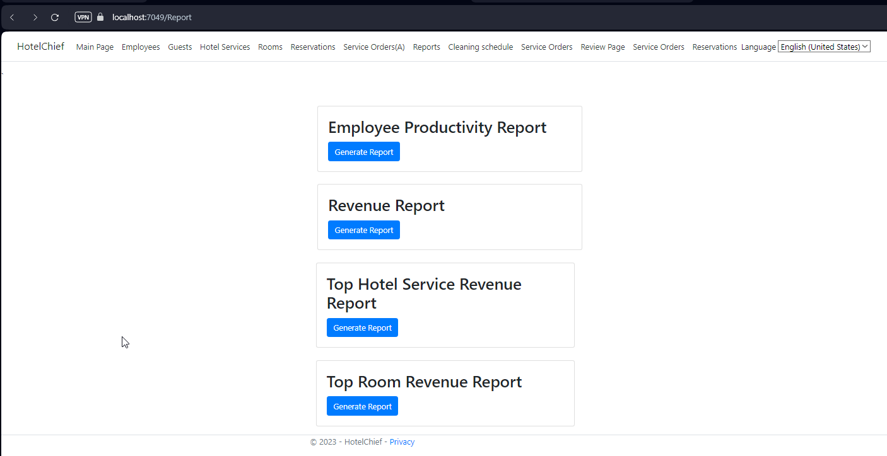
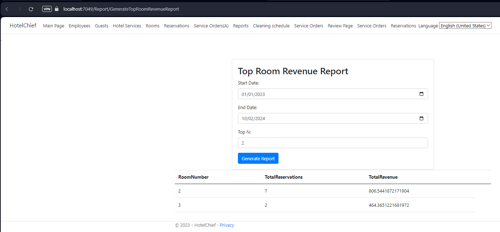
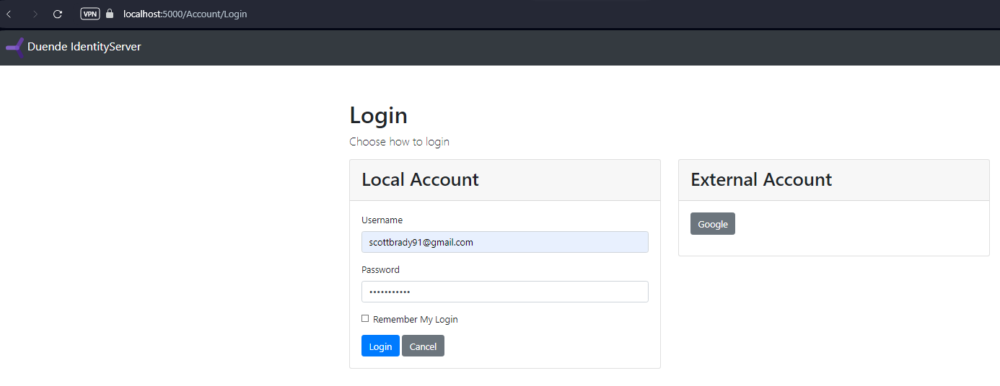
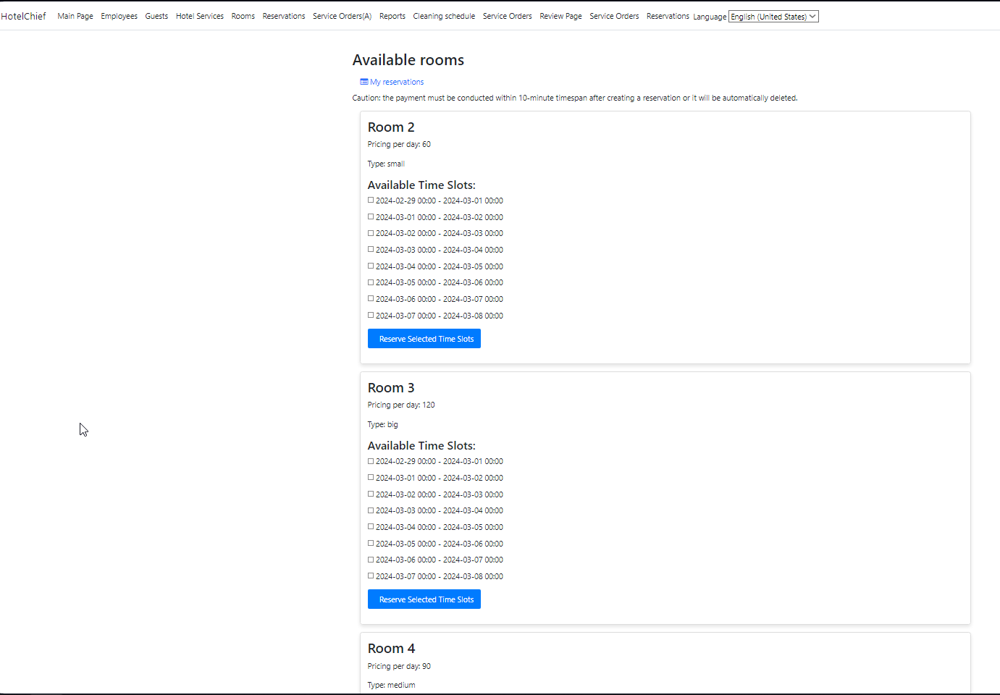
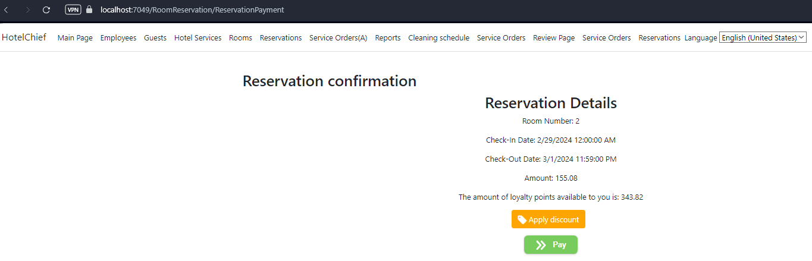
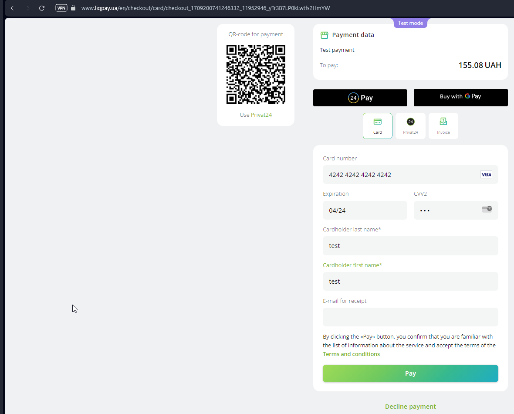

# HotelChief_Project
 Program system for hotel business management
In this project we consider the feasibility of implementation of the next functionality:

- Reservation of rooms online.  ✓
- Personnel management.  ✓
- Accounting for guest services.  ✓
- Registration and authentication of guests.  ✓
- Ability to view which rooms are available.  ✓
- Accounting of financial transactions.  ✓
- Room cleaning schedule.  ✓
- Reports and analytics.  ✓
- Integration with payment systems.  ✓
- Management of the restaurant department of the hotel.  ✗
- Telegram bot integration to notify janitors about upcoming cleanings.  ✓
- Loyalty program for guests.  ✓
- Management of stocks and warehouse logistics.  ✗
- Maintaining guest reviews and ratings.  ✓

.png)
.png)
.png)
